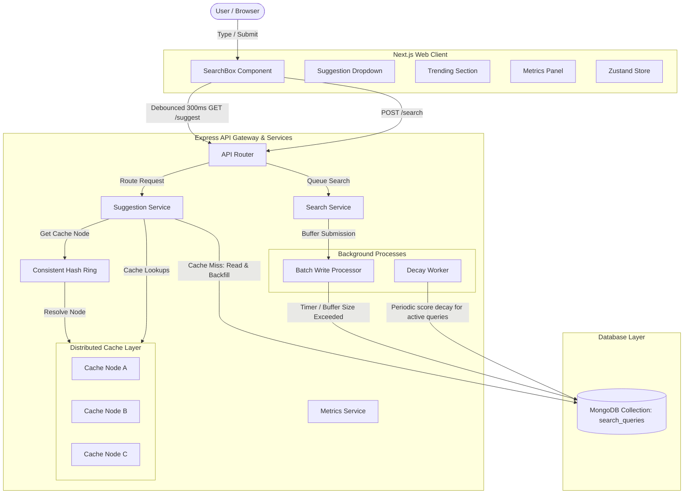
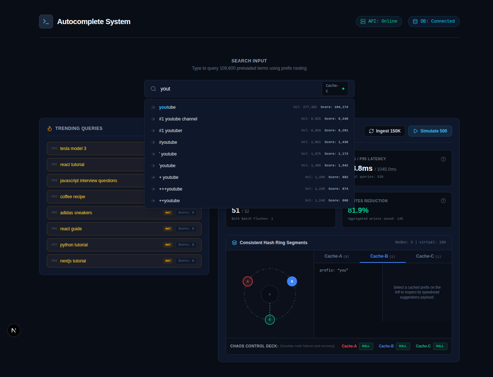
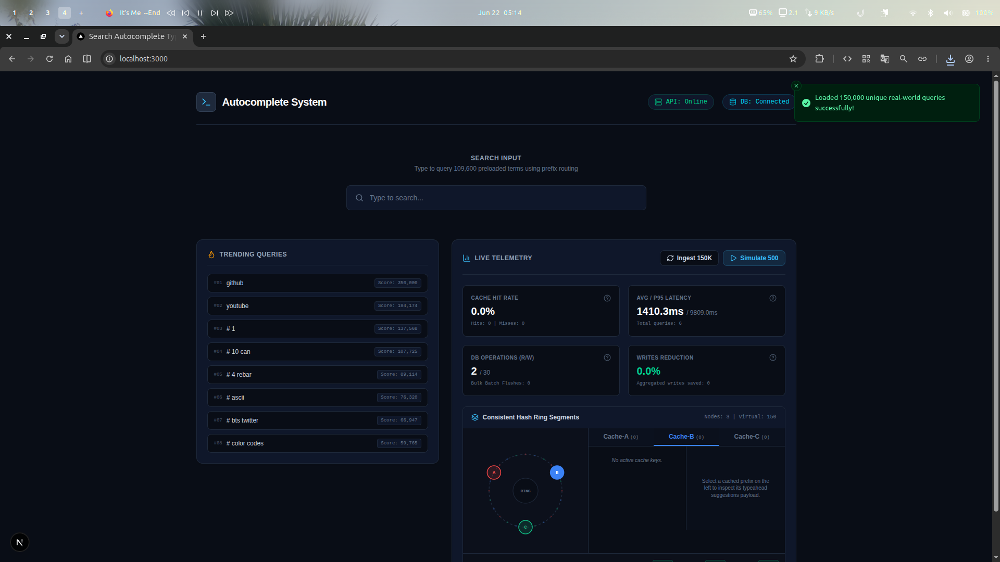

# Distributed Search Typeahead Autocomplete System

A high-performance, production-style implementation of a Search Typeahead System (similar to Google Autocomplete). 

This project demonstrates core backend system design principles, including **Consistent Hashing**, **Distributed Caching Simulation**, **Recency-aware Trending Search Decay**, **Batch Write Aggregation**, and **Real-time Observability Telemetry**.

---

## System Architecture



---

## Interface Preview





---

## Key Features

1. **Consistent Hash Ring Routing:** A consistent hashing ring with virtual nodes (50 per physical node) routes prefix autocomplete lookups uniformly across three logical cache nodes (`Cache-A`, `Cache-B`, `Cache-C`).
2. **Interactive Chaos Control Deck:** Supports simulating hardware outages. Toggling a node offline removes its virtual nodes from the ring, triggering dynamic failover routing to neighboring online nodes.
3. **Linguistic Autocomplete Ranking:** Performs index-supported database candidate fetches, applying a tiered in-memory relevance scoring system (`+1000` starts-with, `+500` word boundary, `+200` exact word match) to prioritize word matching (e.g. typing `"gym"` matches `"24 hour gym"`).
4. **Cache-Aside Strategy:** Serves autocomplete suggestions in sub-millisecond speeds. On a cache miss, suggestions are loaded from MongoDB and backfilled into the cache.
5. **High-Throughput Batch Writes:** Consolidates incoming query search submissions in memory. Flushes to MongoDB in bulk chunks (every 5 seconds or 100 queued items), saving up to 99% of database write operations under heavy traffic.
6. **Time-Decayed Trending Searches:** Integrates a recency-decay scoring mechanism:
   $$\text{Score} = (\text{Historical Count} \times 0.7) + (\text{Decayed Recent Count} \times 1.3)$$
   A background worker applies exponential decay to active queries, keeping trends fresh.
7. **Active Cache Invalidation:** When batch flushes write to MongoDB, all possible prefix combinations of updated queries are invalidated across the distributed cache nodes.
8. **Dynamic Status Indicators:** Polled connection pills in the navbar change to red `"API: Offline"` and `"DB: Disconnected"` state representation when the backend server or MongoDB is stopped.

---

## Directory Structure

```
Typeahead System/
├── backend/
│   ├── src/
│   │   ├── controllers/   # Route controllers (suggest, search, metrics, cache, admin)
│   │   ├── routes/        # Router configuration
│   │   ├── services/      # Business logic classes (caching, metrics)
│   │   ├── models/        # Mongoose database models
│   │   ├── hashing/       # Consistent hashing implementations
│   │   ├── cache/         # Cache Node declarations
│   │   ├── workers/       # Background processors (batch writer, decay worker)
│   │   ├── dataset/       # Dataset loaders and generators
│   │   ├── utils/         # Logger and hashing helpers
│   │   └── app.ts         # Server entry point
│   ├── tsconfig.json
│   └── package.json
├── frontend/
│   ├── src/
│   │   ├── app/           # Next.js pages and layouts
│   │   ├── components/    # Reusable UI components
│   │   ├── hooks/         # Custom React hooks (debounce)
│   │   ├── services/      # Axios API connection
│   │   ├── store/         # Zustand global state store
│   │   └── types/         # TypeScript declarations
│   ├── tsconfig.json
│   └── package.json
├── dataset.csv            # 109,600 row generated dataset
└── README.md
```

---

## Setup Instructions

### Prerequisites
- Node.js (v18+)
- npm
- MongoDB local binary (or service) installed on system

### Dataset Setup (Raw Source)
The codebase includes the pre-processed `dataset.csv` (109,600 records), allowing you to run the application immediately. If you want to re-process or expand the query dataset from the raw source:
1. Download the official **ORCAS Dataset** (tab-separated queries file) from: [Microsoft MS MARCO ORCAS Website](https://microsoft.github.io/msmarco/ORCAS.html).
2. Create a folder named `datasets/` in the project root.
3. Extract and place the downloaded file `orcas-doctrain-queries.tsv` inside it:
   ```text
   Typeahead System/datasets/orcas-doctrain-queries.tsv
   ```
4. Run `npx ts-node backend/src/dataset/generate-dataset.ts` to re-generate the `dataset.csv` file.

### 1. Database Setup
Ensure you have a MongoDB instance running locally on default port `27017`. You can start a local instance using your system's service manager or run `mongod` directly specifying the local data directory:
```bash
mongod --dbpath ./mongodb-data
```

### 2. Backend Setup
Navigate to the `backend` folder, copy settings, install dependencies, and run in dev mode:
```bash
cd backend
npm install
npm run dev
```

### 3. Frontend Setup
Navigate to the `frontend` folder, install dependencies, and run in dev mode:
```bash
cd ../frontend
npm install
npm run dev
```
Open [http://localhost:3000](http://localhost:3000) to view the UI.

---

## API Documentation

### Autocomplete Suggestions
- **Endpoint:** `GET /suggest?q=<prefix>`
- **Response:** Array of up to 10 suggestions, sorted by ranking `score` descending.
- **Example Response:**
  ```json
  [
    {
      "query": "iphone",
      "count": 200000,
      "recentCount": 0,
      "score": 140000
    }
  ]
  ```

### Search Submission
- **Endpoint:** `POST /search`
- **Request Body:** `{ "query": "iphone charger" }`
- **Response Status:** `202 Accepted` (buffers in memory immediately)

### Trending Queries
- **Endpoint:** `GET /trending`
- **Response:** Top 20 trending items sorted by recent count activity (backfilled by popular queries).

### Consistent Hashing Debugging
- **Endpoint:** `GET /cache/debug?prefix=<prefix>`
- **Response:**
  ```json
  {
    "prefix": "iph",
    "hash": 1923812,
    "node": "Cache-B",
    "cacheHit": true
  }
  ```

### Observability Metrics
- **Endpoint:** `GET /metrics`
- **Response:**
  ```json
  {
    "totalRequests": 105,
    "cacheHits": 85,
    "cacheMisses": 20,
    "dbReads": 20,
    "dbWrites": 24,
    "batchFlushCount": 2,
    "writesSaved": 80,
    "cacheHitRate": "81.0%",
    "avgLatencyMs": "1.4ms",
    "p95LatencyMs": "4.2ms",
    "writeReductionPercent": "76.9%",
    "dbConnected": true
  }
  ```

### Toggle Cache Node Status (Chaos Deck)
- **Endpoint:** `POST /cache/node/toggle`
- **Request Body:**
  ```json
  {
    "nodeName": "Cache-B",
    "online": false
  }
  ```
- **Response:**
  ```json
  {
    "success": true,
    "message": "Node Cache-B status set to offline"
  }
  ```

---

## Database Design

**Collection:** `search_queries`
- `query` (String, unique, indexed): Lowercased search term text.
- `count` (Number, indexed): Cumulative historical searches count.
- `recentCount` (Number): Decay-weighted search volume representation.
- `score` (Number, indexed): Combined ranking value used for sorting autocompletions.
- `lastSearchedAt` (Date): Timestamp of last submitted search.

---

## Testing & Verification Steps

1. **Ingest Initial Data:** Open the web app and click **Ingest 150K** (or run `curl -X POST http://localhost:5000/admin/load-dataset`). This will parse the ORCAS dataset and bulk-load 109,600 unique rows into MongoDB.
2. **Perform Autocomplete Search:** Type `iph` inside the search bar. You should immediately see suggestions appear, and the Consistent Hashing debug badge will show `Cache-B` (or similar node) resolving the prefix.
3. **Verify Caching:** Click a suggestion or type and press Enter to search. When you type the prefix again, notice the response is returned instantly (Cache Hit).
4. **Chaos Testing (Failover):** 
   - Click **`KILL`** under `Cache-B` in the **Chaos Control Deck**. 
   - Type a query that hashes to `Cache-B`. 
   - Watch the SVG visualizer instantly route the request pointer to `Cache-C` or `Cache-A`, representing live consistent hashing ring failover.
   - Click **`RESTORE`** to bring it back online.
5. **Stress Test Telemetry:** Click **Simulate 500** in the Metrics Dashboard. This simulates a Zipfian peak-traffic workload and updates the telemetry counters in real-time, showing latency, read/write savings, and consistent hashing node distribution values.
